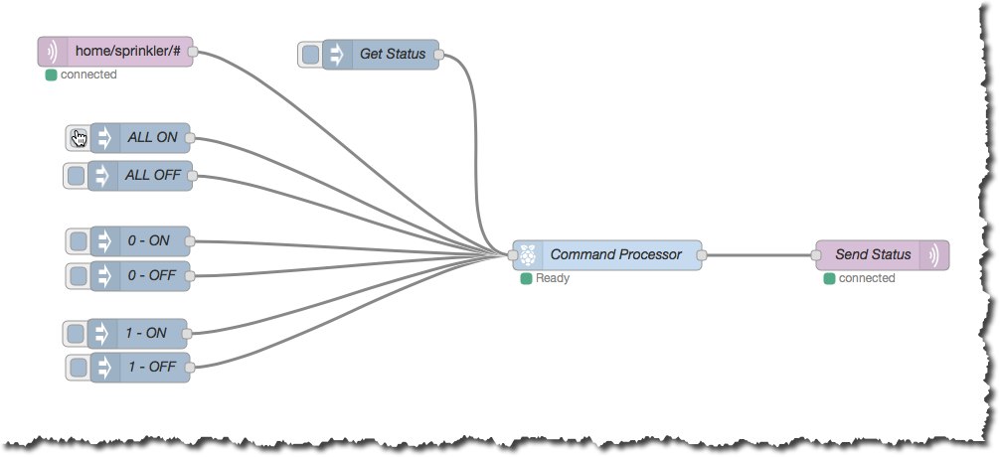
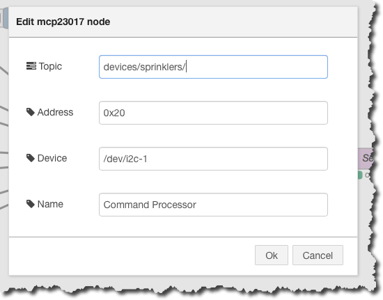
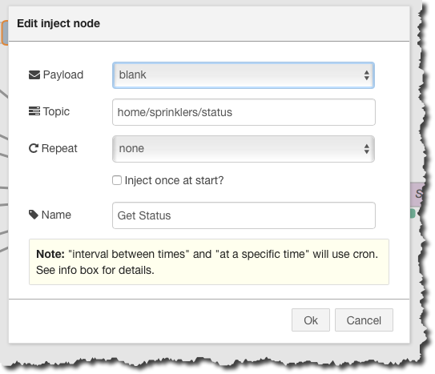

node-red-contrib-mcp23017
=========================

A Node-RED wrapper of of the node-mcp23017 library for the I2C I/O Expander MCP23017 on a Raspberry Pi

It currently only supports writing to the chip. Though you can request a status which will generate a message per pin on the current state.

**NOTE** The outputs are inverted:

* ON gives a LOW on the pin.
* OFF gives a HIGH on the pin.

This is because I'm working with Sainsmart relay boards. See to-do below!

## Prerequisites

In order to use this module with the Raspberry Pi running Raspbian you have to have [node.js](https://nodejs.org/) and [node-mcp23017](https://github.com/kaihenzler/node-mcp23017)

## Installation

install via npm. just type the following in the terminal/console

````bash
cd ~/.node-red
npm install node-red-contrib-mcp23017
````

## Usage

### Sample Workflow


This workflow shows a number of possible triggers feeding the common hardware interface node. The hardware is controlled via the contened of the payload (ON|OFF) and the Topic provided.

The topic path is not important, except it must end in a number 0..15 or the words ALL or STATUS.

e.g.

These require a payload containing either "ON" or "OFF":

* "home/sprinkler/0"
* "home/devices/control/relay/10"
* "5"
* "home/sprinklers/all"

Status does not need or rather ignores the payload:

* "home/sprinklers/status"

When the status topic is received, the node generates a message per pin as a json object and it can be routed out to MQTT as shown in the example above.

### Configuration


#### Topic

The topic is used to define the root of the outgoinf topic for status messages, in the example shown it says "devices/sprinklers/", this will results in "devices/sprinklers/0" through "devices/sprinlers/16" with their associated payloads.

**Example Payload:**
````json
{"pin":15,"value":"OFF"}
````

### Example Inject to get status


## To Do

I want to add a checkbox to allow the ON/OFF to HIGH/LOW mapping to be inverted, to allow a more logical ON -> HIGH, OFF -> LOW.


## Acknowledgement

Built using the [node-mcp2301 library on github](https://github.com/kaihenzler/node-mcp23017) by kaihenzler (Kai Henzler)
